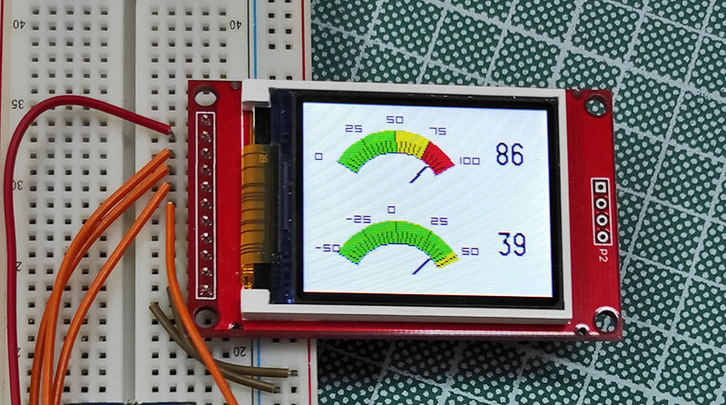

### Analog Gauge

This is an example of an Analog Gauge for TFT screens to be used on Arduino with the [UCG Library](https://github.com/olikraus/ucglib).

This example started from an [Instructable by Bodmer](https://www.instructables.com/Arduino-sketch-for-a-retro-analogue-meter-graphic-/). 

I've made some modifications to it for having a parametrized gauge callable as function and so having also more than one gauge on the screen (even if you must redefine functions for pointers, you'll see). I've changed some things in the code for making it more understandable and opened to modifications.

#### Analog gauge drawing

You can paint the gauge on the screen calling the function:

<code>void drawGauge(uint8_t x, uint8_t y, uint8_t arc, uint8_t radius, uint8_t stp, uint8_t tickl, float gaugemin, float gaugemax, uint8_t decimals, float gz, float yz)</code>

where:

- <code>x</code>, <code>y</code> : are the coordinates of the center of the circle that will describe the gauge. Imagine the Gauge as a top arc of a circle. The pointer will be fixed in this center (even if not visible).

- <code>arc</code> : arc of circle in degree that will describe the gauge. Valid values up to 180.

- <code>radius</code> : radius of the circle that will describe the gauge

- <code>stp</code> : steps, number of "minor" ticks between main ticks. Main ticks are hard-wired as 5

- <code>tickl</code> : length, in pixel, of the main ticks. Minor ticks will be a fraction of this

- <code>gaugemin</code>, <code>gaugemax</code> : minimum and maximum value on the scale. Are float values so you can use decimal and negative numbers too. Only numbers on main ticks will be drawn.

- <code>decimals</code> : number of decimals to be shown on the labels of main ticks. 0 will print no decimals

- <code>gz</code>, <code>y</code> : value for painting green zone and yellow zone respectively. A green arc will be painted from "gaugemin" value to "gz" value. A yellow arc will be painter from "gz" to "yz" value and a red arc will be painted from "yz" to "gaugemax" value.

This function will be called only once, at startup.

#### Pointer drawing

The fuction for painting the pointer is defined as:

<code>void drawPointer(uint8_t x, uint8_t y, uint8_t arc, uint8_t radius, float value, float minval, float maxval)</code>

where:

- <code>x</code>, <code>y</code> : are the coordinates of the "pivot" point of the pointer (where pointer starts). You must use the same coordinates used for the gauge

- <code>arc</code>, <code>radius</code> : have the same meaning used for the gauge, so use the same values

- <code>value</code> : value where the pointer points

- <code>minval</code>, <code>maxval</code> : minimum and maxim values pointer can point to. Usually are the same as <code>gaugemin</code> and <code>gaugemax</code> but you can exceed those values for making pointer go out of scale.

You must call this function everytime you must update the value to be shown. Function itself saves the previous value so it exits quickly, without redrawing all, if passed value to function is the same of the previous call.

The pointer length is hardwired in code (<code>nl</code> variable in the function). The lower part of the pointer (pivot point) will not visible: imagine the pivot point of the pointer covered by a circle. You will see the lower part of the pointer describing an arc while moving. This happens also on most analog gauges in the real such as in Vu-meters for example.

Since the <code>drawPointer</code> function uses static variables for keeping in memory the last pointer position for deleting the pointer when a refresh happens, you cannot use the same function for drawing more than a pointer. This is so I've copied and pasted the function giving it the name <code>drawPointer2</code> name for using it with the second gauge in the example.